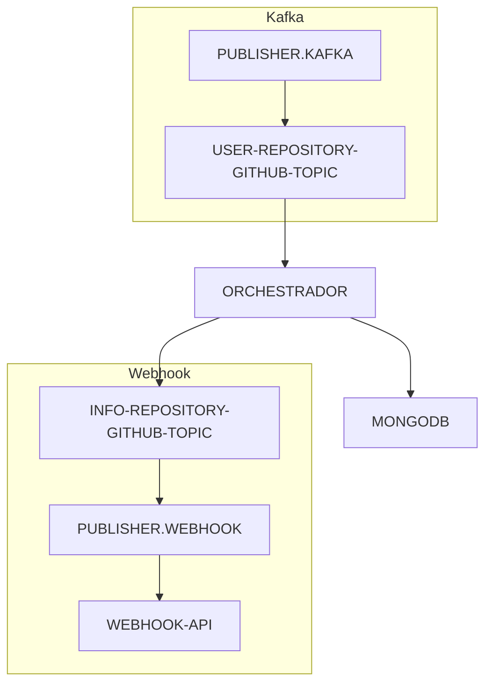

# ORCHESTRADOR #

### Busca dados de APIs via client e integra com outros sistemas ###

Responsável integrar com APIs para buscar dados e redirecionar para API correspondente

### Requisitos ###
Java 17

### Requisitos de teste ###
Docker

### Para executar a aplicação ###
Execute via terminal os comandos abaixo:
```shell
cd .\docker\kafka\ #Navegar até o docker-compose-yml

docker compose up -d #Iniciar o docker e montar os containers

docker exec -it <kafka_container> /bin/bash #Acessar container do kafka

kafka-topics --create --topic USER-REPOSITORY-GITHUB-TOPIC \
     --bootstrap-server localhost:9092  \
     --partitions 1 --replication-factor 1 #Criar tópico usuário e repositório no kafka
       
kafka-topics --create --topic INFO-REPOSITORY-GITHUB-TOPIC \
    --bootstrap-server localhost:9092 \
    --partitions 1 --replication-factor 1 \
    --config retention.ms=86400000 #Criar tópico com informações de repositórios com 1 dia de retenção de mensagens
    
cd .\docker\mongo

docker compose up -d
```

Execute a requisição para registrar cada um dos schemas
```
curl --location 'http://localhost:8081/subjects/user-value/versions' \
--header 'Content-Type: application/vnd.schemaregistry.v1+json' \
--data '{}
'
```
Execute os comando abaixo via terminal para gerar os objetos definidos nos Schemas AVRO
```shell
mvn clan compile
```

Inicie a aplicação.

Inicie a aplicação que publica dados sobre usuário e repositório no tópico USER-REPOSITORY-GITHUB-TOPIC
[publisher.kafka](https://github.com/flpfraga/swap-producer-kafka)

Inicie a aplicação que consome dados do tópico INFO-REPOSITORY-GITHUB-TOPIC e publica via Webhooks
[publisher.webhook](https://github.com/flpfraga/swap-webhook-publishing)

Arquitetura da solução




